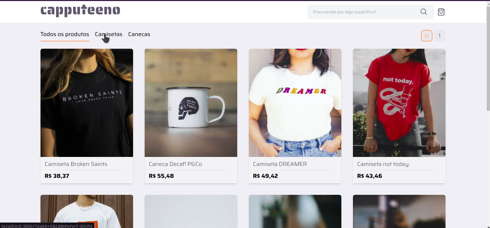

<h1 align="center">
   
</h1>
<h1 align="center" widht="50%">
  
  
  
  
</h1>
 


## ⚡️ The Project
This project is a simple e-commerce website with product listing, filtering and shopping cart functionality using Graphql.
  
## 🎯 Features
 - Graphql queries and mutations
 - Unit tests with React Testing Library
 - e2e tests with Cypress
 - Data persistent using cookis
  
## 🖥️ Used Tecnologies
 - [ReactJs](https://reactjs.org/)
 - [NextJs](https://nextjs.org/)
 - [TailwindCSS](https://tailwindcss.com/)
 - [ApolloClient](https://www.apollographql.com/docs/react/)
 - [Cypress](https://www.cypress.io/)
## ⚙️ Dependencies
 - [Yarn](https://yarnpkg.com/)
 
## 🚀️ Getting Started

1. Clone this repository: 

```bash
git clone https://github.com/avnerjose/reactjs-nextjs-pwa-podcastr
```
2. Go to the folder you cloned the repository and install all dependencies

```bash
yarn
```
3. Start the app
```bash
yarn dev
```
5. Go to the file localhost:3000 to see the app working

## 🐙 Tests 

### Run unit tests

```bash
yarn test
```
### Run e2e tests

```bash
yarn test:e2e
```